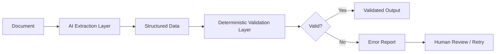
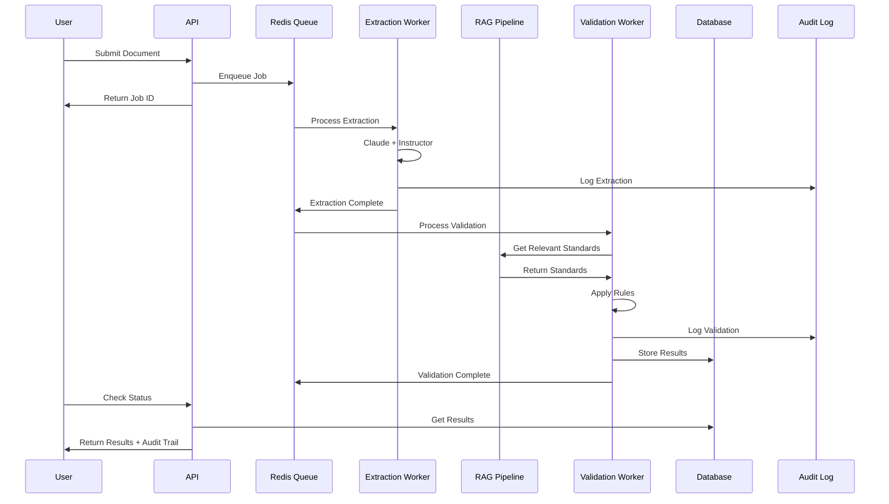

# AI Extraction + Validation Systems Architecture Research

## Executive Summary

This document presents research findings on how AI extraction and validation systems are typically architected, with focus on the "AI extracts, code validates" (AI extrai, codigo valida) principle. The architecture separates non-deterministic AI extraction from deterministic code validation to achieve reproducibility, auditability, and reliability.

---

## Table of Contents

1. [Extraction Pipeline Structures](#1-extraction-pipeline-structures)
2. [Separation of AI Extraction from Deterministic Validation](#2-separation-of-ai-extraction-from-deterministic-validation)
3. [Handling Partial Extraction Failures](#3-handling-partial-extraction-failures)
4. [RAG Integration in Validation Workflows](#4-rag-integration-in-validation-workflows)
5. [Validation Rule Organization](#5-validation-rule-organization)
6. [Audit Trails and Explainability](#6-audit-trails-and-explainability)
7. [Recommended Architecture for AuditEng](#7-recommended-architecture-for-auditeng)

---

## 1. Extraction Pipeline Structures

### Single-Pass vs Multi-Pass Extraction

**Single-Pass Extraction:**
- Simpler architecture, lower latency
- Suitable for well-structured documents with clear schemas
- Risk of missing information or producing inconsistent outputs

**Multi-Pass Extraction (Recommended for Complex Documents):**
- First pass: Initial extraction with broad coverage
- Subsequent passes: Refinement, verification, and gap-filling
- Research shows iterative refinement can achieve F1 scores of 0.99 in clinical applications

```
                    MULTI-PASS EXTRACTION PIPELINE

    +------------------+     +------------------+     +------------------+
    |   Document       |     |   First Pass     |     |   Verification   |
    |   Input          | --> |   Extraction     | --> |   Pass           |
    +------------------+     +------------------+     +------------------+
                                    |                        |
                                    v                        v
                             +-------------+          +-------------+
                             | Structured  |          | Validated   |
                             | Output v1   |          | Output v2   |
                             +-------------+          +-------------+
                                                           |
                                    +----------------------+
                                    v
                             +------------------+
                             |   Refinement     |
                             |   Pass (if needed)|
                             +------------------+
                                    |
                                    v
                             +-------------+
                             | Final       |
                             | Output      |
                             +-------------+
```

### Dual-LLM Adversarial Pattern

Research from bioRxiv demonstrates an effective pattern:
1. **Extractor LLM**: Produces structured outputs based on domain schema
2. **Verifier LLM**: Provides adversarial feedback to detect errors, omissions, inconsistencies
3. **Iterative Refinement**: Two LLMs progressively improve accuracy

This pattern is particularly effective when:
- Document complexity is high
- Domain-specific accuracy is critical
- Single-pass extraction yields inconsistent results

### Chunking Strategies

| Strategy | Description | Best For | Overlap |
|----------|-------------|----------|---------|
| **Fixed-Size** | Equal character/token chunks | Simple documents, speed | 10-20% |
| **Semantic** | Groups by embedding similarity | Complex narratives | Varies |
| **Recursive** | Hierarchical separators (paragraph -> sentence -> word) | Structured documents | 10-15% |
| **LLM-Based** | Model decides split points | High-value documents | Model-determined |

**Recommended Settings:**
- Chunk size: 256-512 tokens (optimal based on testing)
- Overlap: 10-20% to preserve context at boundaries
- Rule of thumb: ~500 words (~650 tokens) with 10-15% overlap

```
          SEMANTIC CHUNKING WITH OVERLAP

    Document:  [===========================================]

    Chunk 1:   [========]
    Overlap:         [==]
    Chunk 2:         [========]
    Overlap:              [==]
    Chunk 3:              [========]
    ...
```

---

## 2. Separation of AI Extraction from Deterministic Validation

### The Core Principle: "AI Extracts, Code Validates"



### Instructor + Pydantic Pattern (Recommended for AuditEng)

Instructor is the recommended library for structured extraction with Claude/Anthropic:

```python
from instructor import from_anthropic
from pydantic import BaseModel, field_validator
from anthropic import Anthropic

# Define schema with built-in validation
class ExtractedData(BaseModel):
    field_name: str
    numeric_value: float
    date_extracted: str

    @field_validator('numeric_value')
    @classmethod
    def validate_positive(cls, v):
        if v < 0:
            raise ValueError('Value must be positive')
        return v

# Instructor handles:
# 1. Schema-guided extraction
# 2. Automatic validation against Pydantic model
# 3. Retry logic when validation fails
# 4. Type coercion and constraints
```

**Key Benefits:**
- Clear separation: Pydantic handles validation, LLM handles extraction
- Automatic retries with Tenacity integration
- Type safety and IDE support
- Built-in validators "for free"

### Three-Layer Architecture

```
    +----------------------------------------------------------+
    |                    APPLICATION LAYER                      |
    |  (API endpoints, job scheduling, user interface)          |
    +----------------------------------------------------------+
                              |
                              v
    +----------------------------------------------------------+
    |                  AI EXTRACTION LAYER                      |
    |  - Claude API with Instructor                             |
    |  - Pydantic schemas for structured output                 |
    |  - Confidence scoring                                     |
    |  - Retry logic with backoff                               |
    +----------------------------------------------------------+
                              |
                              v
    +----------------------------------------------------------+
    |              DETERMINISTIC VALIDATION LAYER               |
    |  - Pure Python validation functions                       |
    |  - Rule engine for business logic                         |
    |  - Schema compliance checking                             |
    |  - Cross-field validation                                 |
    |  - Standards compliance (NBR, technical norms)            |
    +----------------------------------------------------------+
                              |
                              v
    +----------------------------------------------------------+
    |                    PERSISTENCE LAYER                      |
    |  - Validated results storage                              |
    |  - Audit trail logging                                    |
    |  - Version control for extractions                        |
    +----------------------------------------------------------+
```

### Reproducibility Through Deterministic Validation

The AI layer is inherently non-deterministic, but validation must be deterministic:

| Aspect | AI Extraction | Code Validation |
|--------|---------------|-----------------|
| Determinism | Non-deterministic | Fully deterministic |
| Reproducibility | Same input may vary | Same input = same output |
| Testing | Fuzzy/threshold-based | Unit testable |
| Auditability | Requires logging | Inherently traceable |
| Customization | Prompt engineering | Code/configuration |

**Achieving Reproducibility:**
1. Set temperature to 0 and use seed parameter where supported
2. Log all extraction inputs/outputs
3. Validation layer produces identical results given same extracted data
4. Version control for both prompts and validation rules

---

## 3. Handling Partial Extraction Failures

### Confidence Scoring Methods

| Method | Reliability | Implementation |
|--------|-------------|----------------|
| **Token Log Probability** | High | Aggregate log probs per field |
| **Self-Reported Confidence** | Low (often overconfident) | Prompt for confidence |
| **Attribution-Based** | High | Link extraction to source |
| **Verifier LLM** | Medium-High | Second model validates |

**Recommended: Token Log Probability + Attribution**

```python
class ExtractionResult(BaseModel):
    value: str
    confidence: float  # 0.0 - 1.0
    source_reference: str  # Page/section attribution
    extraction_method: str

    class Config:
        # Confidence thresholds
        HIGH_CONFIDENCE = 0.85
        MEDIUM_CONFIDENCE = 0.70
        LOW_CONFIDENCE = 0.50
```

### Handling Strategies by Confidence Level

```
    CONFIDENCE-BASED ROUTING

    Extraction Result
          |
          v
    +----------------+
    | Confidence     |
    | Score          |
    +----------------+
          |
    +-----+-----+-----+
    |           |     |
    v           v     v
  >= 0.85    0.70-  < 0.70
    |        0.85     |
    |          |      |
    v          v      v
  Auto-     Flag    Human
  Accept    Review  Required
```

### Partial Failure Recovery Patterns

1. **Field-Level Granularity**: Track confidence per field, not per document
2. **Graceful Degradation**: Return partial results with confidence indicators
3. **Re-extraction Pipeline**: Queue low-confidence fields for re-extraction
4. **Human-in-the-Loop**: Route uncertain extractions to human review

```python
class PartialExtractionResult:
    successful_fields: dict[str, FieldResult]
    failed_fields: list[str]
    low_confidence_fields: dict[str, FieldResult]

    def requires_human_review(self) -> bool:
        return len(self.low_confidence_fields) > 0 or len(self.failed_fields) > 0

    def get_extraction_quality_score(self) -> float:
        total = len(self.successful_fields) + len(self.failed_fields) + len(self.low_confidence_fields)
        high_quality = sum(1 for f in self.successful_fields.values() if f.confidence > 0.85)
        return high_quality / total if total > 0 else 0.0
```

---

## 4. RAG Integration in Validation Workflows

### RAG Architecture for Technical Standards

```
    RAG-ENHANCED VALIDATION PIPELINE

    +------------------+
    |  Technical       |
    |  Standards DB    |
    |  (NBR, norms)    |
    +------------------+
           |
           | Offline Indexing
           v
    +------------------+
    | Vector Index     |
    | (embeddings)     |
    +------------------+
           |
           | Online Query
           v
    +------------------+     +------------------+
    | Extracted Data   | --> | Validation       |
    | to Validate      |     | Query Generator  |
    +------------------+     +------------------+
                                    |
                                    v
                             +------------------+
                             | Relevant         |
                             | Standards        |
                             | Retrieved        |
                             +------------------+
                                    |
                                    v
                             +------------------+
                             | Validation       |
                             | Engine + Context |
                             +------------------+
                                    |
                                    v
                             +------------------+
                             | Validation       |
                             | Result + Refs    |
                             +------------------+
```

### RAG Pipeline Components

**Data Pipeline (Offline):**
1. **Chunking**: Break standards into semantically relevant parts
2. **Enrichment**: Add metadata (standard number, section, effective date)
3. **Embedding**: Vectorize chunks for similarity search
4. **Indexing**: Store in vector database (Pinecone, Weaviate, pgvector)

**Query Pipeline (Online):**
1. **Query Generation**: Convert validation context to search query
2. **Hybrid Search**: Combine vector similarity + keyword search
3. **Context Assembly**: Gather relevant chunks within context window
4. **Validation Execution**: Apply retrieved standards to validation

### Best Practices for RAG in Validation

1. **Hybrid Search**: Combine vector + term-based search for best results
2. **Chunk Expansion**: Retrieve neighboring chunks for complete context
3. **Metadata Filtering**: Filter by standard type, version, applicability
4. **Context Window Management**: Ensure relevant information fits LLM limits
5. **Response Validation**: Verify generated validation references actual standards

```python
class RAGValidationContext:
    def __init__(self, vector_store, embedding_model):
        self.vector_store = vector_store
        self.embedding_model = embedding_model

    def get_relevant_standards(self, extraction: ExtractedData) -> list[StandardChunk]:
        # Generate validation-focused query
        query = self._build_validation_query(extraction)

        # Hybrid search: vector + keyword
        results = self.vector_store.hybrid_search(
            query=query,
            filters={"standard_type": extraction.domain},
            top_k=5
        )

        # Expand context with neighboring chunks
        expanded = self._expand_chunks(results)

        return expanded

    def validate_with_context(self, extraction: ExtractedData, standards: list[StandardChunk]) -> ValidationResult:
        # Deterministic validation with RAG context
        # Code validates, AI provides context
        pass
```

---

## 5. Validation Rule Organization

### Rule Engine Patterns

**Pattern 1: Code-Based Rules (Recommended for Core Logic)**

```python
from abc import ABC, abstractmethod
from dataclasses import dataclass

@dataclass
class ValidationResult:
    is_valid: bool
    rule_id: str
    message: str
    severity: str  # "error", "warning", "info"
    evidence: dict

class ValidationRule(ABC):
    @property
    @abstractmethod
    def rule_id(self) -> str:
        pass

    @abstractmethod
    def validate(self, data: dict) -> ValidationResult:
        pass

class NumericRangeRule(ValidationRule):
    def __init__(self, field: str, min_val: float, max_val: float):
        self.field = field
        self.min_val = min_val
        self.max_val = max_val

    @property
    def rule_id(self) -> str:
        return f"RANGE_{self.field.upper()}"

    def validate(self, data: dict) -> ValidationResult:
        value = data.get(self.field)
        is_valid = self.min_val <= value <= self.max_val
        return ValidationResult(
            is_valid=is_valid,
            rule_id=self.rule_id,
            message=f"{self.field} must be between {self.min_val} and {self.max_val}",
            severity="error" if not is_valid else "info",
            evidence={"value": value, "range": [self.min_val, self.max_val]}
        )
```

**Pattern 2: Configuration-Driven Rules**

```python
# rules_config.yaml
rules:
  - id: "NBR_5626_PRESSURE"
    type: "range"
    field: "test_pressure"
    min: 0.5
    max: 1.5
    unit: "MPa"
    standard_ref: "NBR 5626:2020, Section 7.3"

  - id: "CROSS_FIELD_CHECK"
    type: "expression"
    expression: "flow_rate / pipe_diameter < 2.5"
    standard_ref: "NBR 5626:2020, Section 8.1"
```

```python
class ConfigurableRuleEngine:
    def __init__(self, config_path: str):
        self.rules = self._load_rules(config_path)

    def _load_rules(self, path: str) -> list[ValidationRule]:
        config = yaml.safe_load(open(path))
        return [self._create_rule(r) for r in config['rules']]

    def validate_all(self, data: dict) -> list[ValidationResult]:
        return [rule.validate(data) for rule in self.rules]
```

### Rule Organization Architecture

```
    VALIDATION RULE HIERARCHY

    +------------------+
    |   Rule Engine    |
    +------------------+
            |
    +-------+-------+-------+
    |       |       |       |
    v       v       v       v
  Schema  Business  Cross-   Standard
  Rules   Rules     Field    Compliance
    |       |       |       |
    v       v       v       v
  - Type   - Range  - A<B   - NBR refs
  - Format - Enum   - Sum   - ISO refs
  - Required        - Calc  - ABNT refs
```

### Comparison: Configuration vs Code

| Aspect | Configuration | Code |
|--------|---------------|------|
| **Flexibility** | High for simple rules | Unlimited |
| **Maintainability** | Non-dev editable | Requires dev |
| **Testing** | Harder to unit test | Full test coverage |
| **Performance** | Interpretation overhead | Compiled/optimized |
| **Versioning** | File-based | Git-friendly |
| **Complex Logic** | Limited | Full Python power |

**Recommendation for AuditEng:**
- Core validation logic: Code-based (Python functions)
- Threshold values and parameters: Configuration (YAML/JSON)
- Standard references: Database with RAG integration
- Business rules that change frequently: Configuration-driven

---

## 6. Audit Trails and Explainability

### What to Log

```python
@dataclass
class AuditEntry:
    # Identity
    entry_id: str
    timestamp: datetime

    # Context
    document_id: str
    job_id: str
    user_id: Optional[str]

    # Extraction Details
    extraction_input: dict  # Document metadata
    extraction_output: dict  # Structured result
    extraction_model: str  # e.g., "claude-3-opus"
    extraction_prompt_version: str
    extraction_confidence: dict[str, float]

    # Validation Details
    validation_rules_applied: list[str]
    validation_results: list[ValidationResult]
    validation_context: dict  # RAG-retrieved standards

    # Decision
    final_status: str  # "approved", "rejected", "pending_review"
    decision_explanation: str
    human_override: Optional[dict]
```

### Audit Trail Architecture

```
    AUDIT TRAIL SYSTEM

    +------------------+     +------------------+
    | Extraction       | --> | Audit Logger     |
    | Service          |     |                  |
    +------------------+     +------------------+
                                    |
    +------------------+            |
    | Validation       | -----------+
    | Service          |            |
    +------------------+            |
                                    v
    +------------------+     +------------------+
    | Human Review     | --> | Immutable        |
    | Actions          |     | Audit Store      |
    +------------------+     +------------------+
                                    |
                              +-----+-----+
                              |           |
                              v           v
                        +--------+   +--------+
                        | Search |   | Report |
                        | Index  |   | Gen    |
                        +--------+   +--------+
```

### Explainability Mechanisms

**1. Decision Traceability:**
```python
class ValidationDecision:
    result: bool
    rules_triggered: list[RuleResult]
    standards_referenced: list[StandardReference]
    confidence_scores: dict[str, float]

    def explain(self) -> str:
        """Generate human-readable explanation"""
        explanation = []
        for rule in self.rules_triggered:
            explanation.append(
                f"Rule {rule.id}: {rule.status} - {rule.message}"
                f"\n  Reference: {rule.standard_ref}"
                f"\n  Evidence: {rule.evidence}"
            )
        return "\n".join(explanation)
```

**2. Attribution to Source:**
```python
class ExtractedField:
    value: Any
    source_page: int
    source_text: str  # Original text that was extracted from
    confidence: float
    extraction_rationale: str  # Why AI extracted this value
```

**3. Validation Chain:**
```
Document --> Extraction --> Validation --> Decision
    |             |              |            |
    v             v              v            v
  [hash]     [log entry]   [rule trace]  [explanation]
```

### Compliance Considerations

- **GDPR/LGPD**: Right to explanation for automated decisions
- **EU AI Act**: High-risk AI systems require decision logs
- **Financial Services**: Documented model development and validation
- **Healthcare/FDA**: Audit trails for AI-assisted decisions

---

## 7. Recommended Architecture for AuditEng

### High-Level Architecture

```
    AUDITENG SYSTEM ARCHITECTURE

    +----------------------------------------------------------+
    |                       API LAYER                           |
    |  FastAPI / Flask endpoints                                |
    +----------------------------------------------------------+
                              |
                              v
    +----------------------------------------------------------+
    |                    JOB QUEUE LAYER                        |
    |  Redis + RQ (background processing)                       |
    |  - Document ingestion jobs                                |
    |  - Extraction jobs                                        |
    |  - Validation jobs                                        |
    +----------------------------------------------------------+
                              |
          +-------------------+-------------------+
          |                                       |
          v                                       v
    +------------------+                 +------------------+
    | EXTRACTION       |                 | RAG PIPELINE     |
    | PIPELINE         |                 |                  |
    | - Claude API     |                 | - Vector Store   |
    | - Instructor     |                 | - Standards DB   |
    | - Pydantic       |                 | - Embeddings     |
    +------------------+                 +------------------+
          |                                       |
          +-------------------+-------------------+
                              |
                              v
    +----------------------------------------------------------+
    |                VALIDATION LAYER                           |
    |  Deterministic Python validation                          |
    |  - Schema validation (Pydantic)                           |
    |  - Business rules (code + config)                         |
    |  - Standards compliance (RAG-enhanced)                    |
    +----------------------------------------------------------+
                              |
                              v
    +----------------------------------------------------------+
    |                  PERSISTENCE LAYER                        |
    |  - PostgreSQL (validated results)                         |
    |  - Audit log storage                                      |
    |  - Document storage (S3/MinIO)                            |
    +----------------------------------------------------------+
```

### Redis + RQ Job Processing Pattern

```python
from redis import Redis
from rq import Queue

redis_conn = Redis()
extraction_queue = Queue('extraction', connection=redis_conn)
validation_queue = Queue('validation', connection=redis_conn)

def process_document(document_id: str):
    """Main job orchestrator"""
    # Enqueue extraction job
    extraction_job = extraction_queue.enqueue(
        extract_document,
        document_id,
        job_timeout='10m'
    )

    # Validation depends on extraction
    validation_job = validation_queue.enqueue(
        validate_extraction,
        depends_on=extraction_job,
        job_timeout='5m'
    )

    return validation_job.id

def extract_document(document_id: str) -> ExtractionResult:
    """AI extraction job - may fail/retry"""
    document = load_document(document_id)

    # Use Instructor for structured extraction
    result = instructor_client.create(
        model="claude-3-opus-20240229",
        response_model=DocumentExtraction,
        messages=[...],
        max_retries=3
    )

    # Log extraction for audit trail
    log_extraction(document_id, result)

    return result

def validate_extraction(extraction: ExtractionResult) -> ValidationResult:
    """Deterministic validation - always reproducible"""
    # Get relevant standards via RAG
    standards = rag_pipeline.get_relevant_standards(extraction)

    # Apply validation rules
    results = validation_engine.validate_all(extraction.data, standards)

    # Log validation for audit trail
    log_validation(extraction.id, results)

    return results
```

### Component Responsibilities

| Component | Responsibility | Deterministic? |
|-----------|---------------|----------------|
| API Layer | Request handling, auth | Yes |
| Job Queue | Orchestration, retry | Yes |
| Extraction | AI-powered parsing | No (logged) |
| RAG Pipeline | Context retrieval | Yes |
| Validation | Rule application | Yes |
| Audit Logger | Trail creation | Yes |
| Persistence | Storage | Yes |

### Data Flow



---

## References and Sources

### Document Processing & Extraction
- [Extend - Document Ingestion Guide](https://www.extend.ai/resources/document-ingestion-ai-processing-guide)
- [Microsoft Azure - Multi-Modal Content Processing](https://learn.microsoft.com/en-us/azure/architecture/ai-ml/idea/multi-modal-content-processing)
- [V7 Labs - Document Processing Platform Guide](https://www.v7labs.com/blog/document-processing-platform)

### Structured Extraction Libraries
- [Instructor Documentation](https://python.useinstructor.com/)
- [Instructor GitHub](https://github.com/567-labs/instructor)
- [Instructor Validation Concepts](https://python.useinstructor.com/concepts/validation/)
- [Instructor Retry Logic with Tenacity](https://python.useinstructor.com/concepts/retrying/)

### RAG Architecture
- [Microsoft Azure - RAG Solution Design](https://learn.microsoft.com/en-us/azure/architecture/ai-ml/guide/rag/rag-solution-design-and-evaluation-guide)
- [NVIDIA - RAG 101](https://developer.nvidia.com/blog/rag-101-demystifying-retrieval-augmented-generation-pipelines/)
- [InfoQ - Architecting RAG Pipeline](https://www.infoq.com/articles/architecting-rag-pipeline/)

### Chunking Strategies
- [Pinecone - Chunking Strategies](https://www.pinecone.io/learn/chunking-strategies/)
- [Weaviate - Chunking Strategies for RAG](https://weaviate.io/blog/chunking-strategies-for-rag)
- [Chroma Research - Evaluating Chunking](https://research.trychroma.com/evaluating-chunking)

### Rule Engines
- [Python Rule Engine Tutorial](https://zato.io/en/docs/4.1/rule-engine/tutorial.html)
- [Venmo Business Rules](https://github.com/venmo/business-rules)
- [Django Stars - Python Rule Engine](https://djangostars.com/blog/python-rule-engine/)

### Audit Trails & Explainability
- [Aptus Data Labs - AI Audit Trails](https://www.aptusdatalabs.com/thought-leadership/the-rise-of-ai-audit-trails-ensuring-traceability-in-decision-making)
- [Latitude - Audit Logs in AI Systems](https://latitude-blog.ghost.io/blog/audit-logs-in-ai-systems-what-to-track-and-why/)
- [FINOS - Agent Decision Audit and Explainability](https://air-governance-framework.finos.org/mitigations/mi-21_agent-decision-audit-and-explainability.html)

### Confidence Scoring
- [Sensible - Confidence Signals](https://www.sensible.so/blog/confidence-signals)
- [Alkymi - Building Confidence in LLM Outputs](https://www.alkymi.io/data-science-room/building-confidence-in-llm-outputs)
- [Infrrd - Confidence Scores in LLMs](https://www.infrrd.ai/blog/confidence-scores-in-llms)

### Background Processing
- [RQ Documentation](https://python-rq.org/docs/)
- [Twilio - Async Tasks with Redis Queue](https://www.twilio.com/en-us/blog/asynchronous-tasks-in-python-with-redis-queue)
- [FastAPI + Redis Queue](https://medium.com/@akintolaolamilekan51/asynchronous-job-processing-using-redis-queue-and-fastapi-c4ae97272a46)

### Multi-Pass Extraction
- [Nature - Iterative Refinement for Clinical Information Extraction](https://www.nature.com/articles/s41746-025-01686-z)
- [bioRxiv - Dual-LLM Adversarial Framework](https://www.biorxiv.org/content/10.1101/2025.09.11.675507v1.full)

---

## Summary

The recommended architecture for AuditEng follows these key principles:

1. **Clear Separation**: AI handles extraction (non-deterministic), code handles validation (deterministic)
2. **Structured Output**: Use Instructor + Pydantic for type-safe, validated extraction
3. **Confidence-Based Routing**: Track confidence per field, route low-confidence to human review
4. **RAG-Enhanced Validation**: Use vector search to retrieve relevant standards for validation context
5. **Hybrid Rule Engine**: Core logic in code, thresholds in configuration
6. **Comprehensive Audit Trail**: Log every extraction, validation, and decision for explainability
7. **Background Processing**: Redis + RQ for scalable async job processing

This architecture ensures reproducibility (same input produces same validated output), auditability (complete trail of decisions), and reliability (deterministic validation with graceful failure handling).
